# KHEL·1

A portfolio built as a handheld game console. Every project is a cartridge: pick one off the shelf, push it into the slot, flip the power switch and press Start. 

Made by [Aaryan Basnet](https://aaryanbasnet.com.np/), Kathmandu.

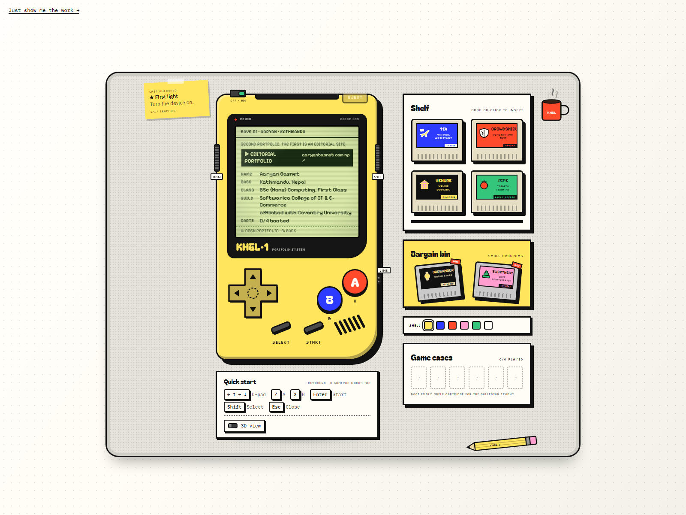

## What's on the desk

- **The console.** A working screen, d-pad, A and B, Start and Select, a power switch, a contrast wheel that cycles screen palettes, a volume wheel, an eject button and a link cable port. The whole thing tilts toward your pointer, and a 3D toggle turns it into a box you can spin.
- **The shelf.** Four project cartridges you drag or click into the slot, and a bargain bin with two smaller ones. Each cartridge has its own label art, screen palette and boot jingle.
- **Game cases.** One empty case per cartridge, filled in as you boot them.
- **The manual.** Select opens an instruction booklet for whatever is in the slot. It only talks about the real project, never about the game on the screen.
- **The back.** Flip the console over from the menu to find the screws, the battery cover and the specification label.
- **Trophies.** Seventeen small achievements for exploring, from turning the power on to clearing every room in the dungeon. The sticky note on the desk shows the last one you earned.

<table>
  <tr>
    <td align="center">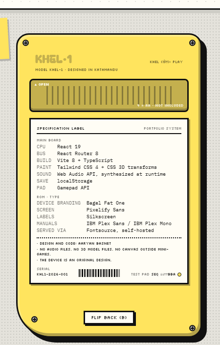</td>
    <td align="center">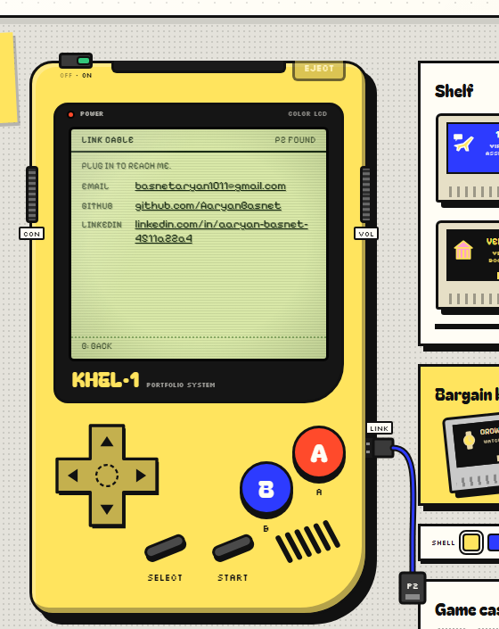</td>
    <td align="center">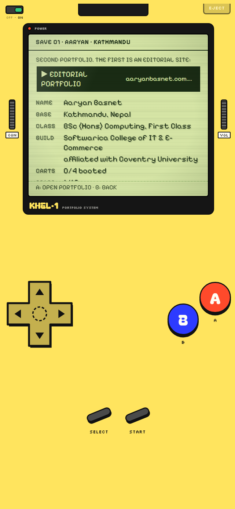</td>
  </tr>
  <tr>
    <td align="center">Back of the device</td>
    <td align="center">Link cable (contact)</td>
    <td align="center">On a phone</td>
  </tr>
</table>

## The cartridges

Each cartridge is a small program that plays with what the real project does. The manual (Select) has the facts.

<table>
  <tr>
    <td align="center">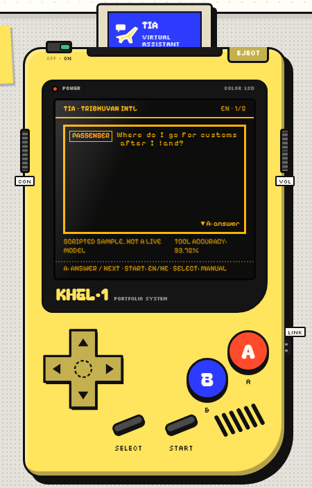</td>
    <td align="center">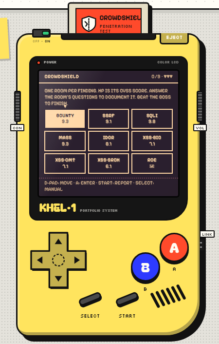</td>
    <td align="center">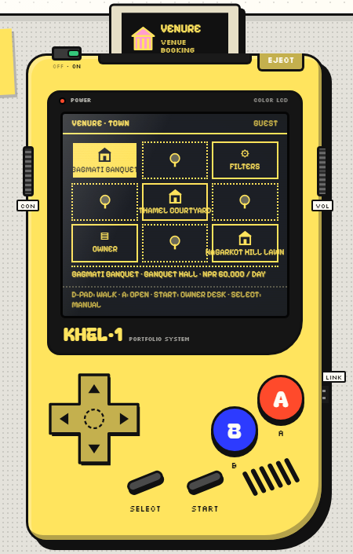</td>
  </tr>
  <tr>
    <td><b>TIA</b> · Virtual assistant, final-year thesis. A passenger question flaps onto an airport departure board, A posts the answer, and the board notes which tool the ReAct agent called for it. Start flips the board into Nepali.</td>
    <td><b>CrowdShield</b> · Penetration test report. Nine rooms, one per finding, whose HP is its CVSS score. You clear a room by answering its severity band and one metric from its vector. Wrong answers cost hearts. The boss is the RCE.</td>
    <td><b>Venure</b> · Venue booking platform. Walk a 3×3 town, filter the venues, open one and book it on a real calendar. Then sit at the owner desk and approve what came in.</td>
  </tr>
  <tr>
    <td align="center">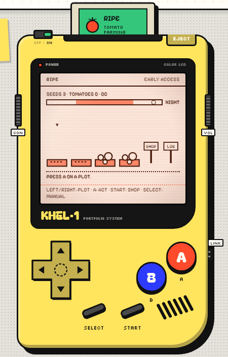</td>
    <td align="center">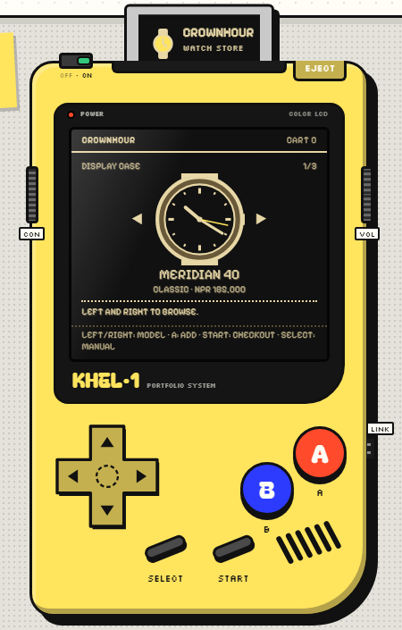</td>
    <td align="center">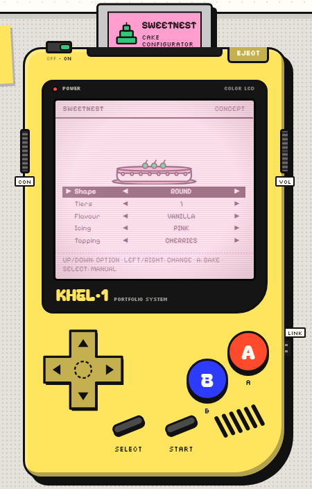</td>
  </tr>
  <tr>
    <td><b>Ripe</b> · Tomato farming game in Godot, in development. Clear rocky plots, plant, water and harvest. Sell at the shop for seeds or a watering can. The real clock drives day, night and rain, and plants keep growing while the cartridge is out.</td>
    <td><b>CrownHour</b> · Watch store on the MERN stack. A display case whose watch face keeps real time. Fill a cart, run the checkout, then follow the order through tracking.</td>
    <td><b>SweetNest</b> · Cake configurator, concept only. Five options, a cake that redraws as you change them, and an order sheet when you bake.</td>
  </tr>
</table>

There is also a hidden system cartridge. The hint for the sequence is printed on the back of the device.

## Run it

```bash
npm install
npm run dev
```

`npm run build` produces a static site in `dist/`. Any static host works; the router needs every path to serve `index.html`.

## Controls

| Input | Action |
| --- | --- |
| D-pad / arrow keys | Move |
| A / `Z` | Confirm |
| B / `X` | Back |
| Start / `Enter` | Open the menu, play the loaded cartridge, or the cartridge's second action |
| Select / `Shift` | Open the manual |
| `Esc` | Close the manual or go home |

A standard gamepad works too. The quick-start card under the console repeats this.

## Routes

`/` the device · `/cart/:id` boots that cartridge · `/about` save file · `/contact` link cable · `/colophon` back of the device · `/plain` the readable version of everything.

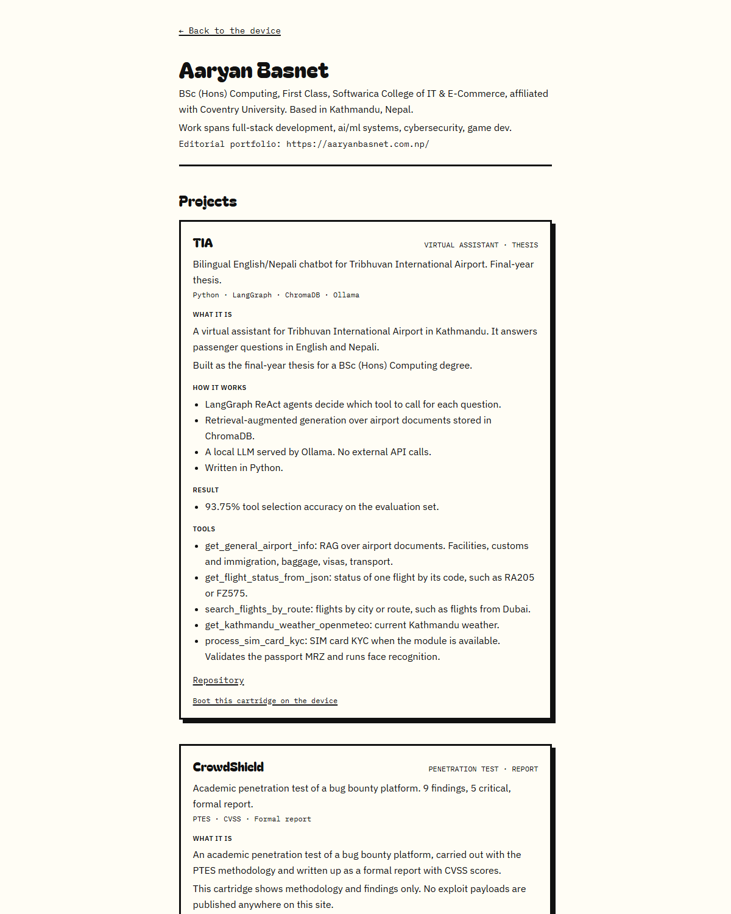

## Editing content

Everything the site says lives in `src/content/`. Components only render it.

| File | What it holds |
| --- | --- |
| `profile.ts` | Save-file (about) text, link-cable (contact) links, colophon |
| `cartridges.ts` | One entry per project: label colours, screen palette, jingle, manual sections, links |
| `tia-transcript.ts` | The scripted English/Nepali exchanges and tool names for the TIA cartridge |
| `crowdshield-rooms.ts` | The 9 dungeon rooms with their CVSS scores and vectors |
| `venure.ts` | Venues, their town tiles and tags, and the filter names |
| `ripe-patchnotes.ts` | The build log shown on the LOG sign |
| `crownhour.ts` | Watch models, checkout steps and tracking stages for the display case |
| `sweetnest.ts` | The cake configurator's options |
| `achievements.ts` | Achievement ids, titles and how to earn them |

## Accessibility

- `/plain` is the same content as plain articles, no console required. There is a link to it at the top-left of every page.
- Every screen announces itself to screen readers, and every on-screen control is a real button with a label.
- `prefers-reduced-motion` turns off the flips, flickers, tilt and animations.
- Settings, trophies and game progress live in `localStorage` only. Nothing is sent anywhere.

## Stack

React 19, Vite, TypeScript, Tailwind CSS 4, React Router. Fonts are self-hosted through Fontsource. Sound is synthesised with the Web Audio API and the 3D view is CSS transforms: there are no audio files, no 3D libraries and no canvas.

## Screenshots

The images in `docs/screenshots/` were captured from the dev server with headless Chrome:

```bash
chrome --headless=new --hide-scrollbars --window-size=1600,1200 --virtual-time-budget=9000 --screenshot=hero.png http://localhost:5199/about
```
